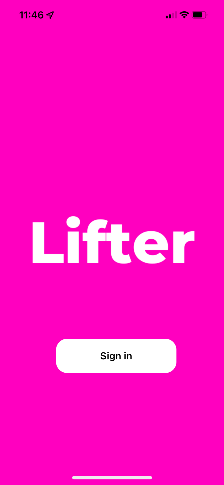
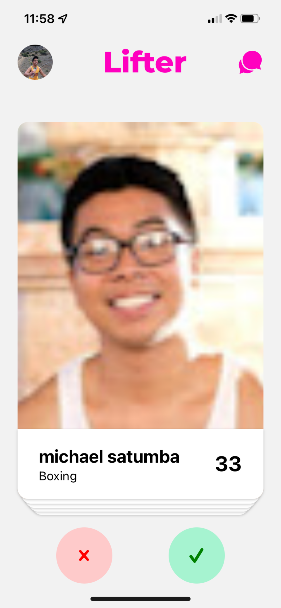
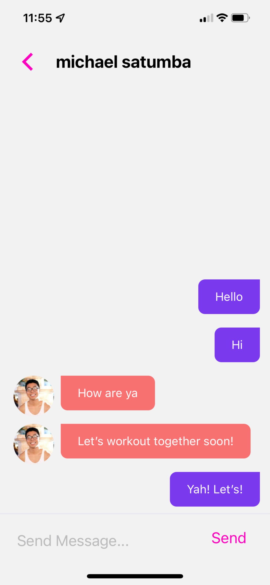
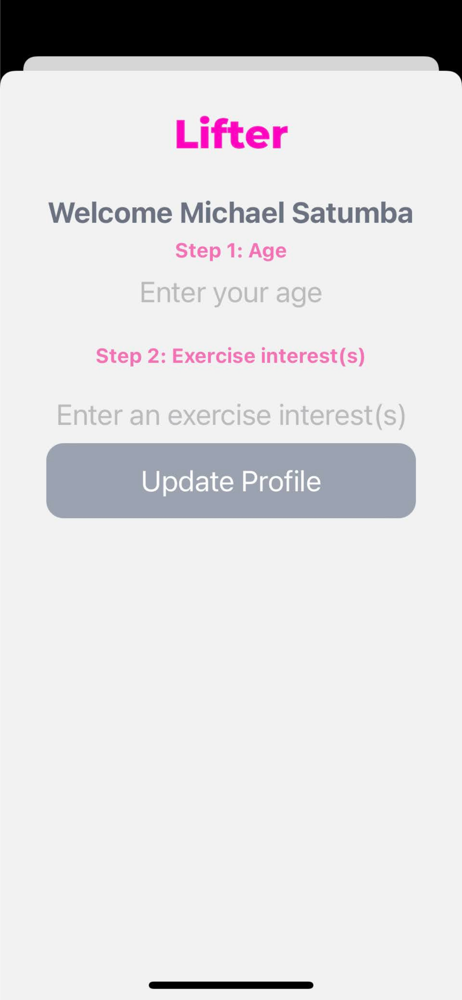

# lifter-ios-v1

It's like tinder but instead of finding romantic partners, the app helps you find workout partners based on your exercise interests.

https://www.youtube.com/watch?v=9fLxIIP33Yk&t=3s

To start

1. Run yarn or npm install to install all neccessary dependancies
2. Run expo start to launch the bundler (you need to have installed expo-cli to do this!)
3. Launch the app on iOS or Android using the expo CLI or interface! (Check Expo docs for more information)

Enjoy the build!

